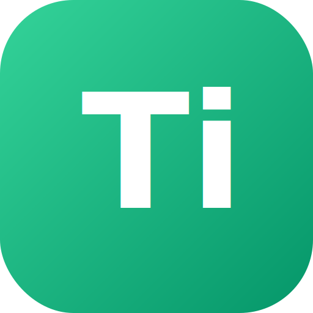

<p align="center">
  
</p>

<h1 align="center">iTrun</h1>

<p align="center">
  <strong>AI 多协议中转客户端</strong><br/>
  统一代理入口，支持 Codex · Claude · OpenAI · Gemini · DeepSeek · Qwen · Kimi 等主流 AI API
</p>

<p align="center">
  
  
  
  
</p>

---

## 功能

- **🔄 多 Provider 支持** — OpenAI / Anthropic / DeepSeek / Qwen / Kimi / Gemini / Groq / NVIDIA / SiliconFlow / xAI 等 11+ 供应商
- **🔀 智能路由** — 模型名自动匹配 Provider，无匹配时透明代理转发
- **📊 实时仪表盘** — Token 用量趋势、延迟分布、实时请求监控
- **📋 请求历史** — 搜索/筛选/分页，JSON 格式化查看
- **🖥️ 微信风格 UI** — 窄图标栏 + 列表/详情双栏布局，浅色/深色主题
- **🔧 Codex 配置管理** — 多 Profile 切换，备份/恢复，一键应用，TOML 格式完整保留
- **📡 本地代理** — `localhost:9876`，兼容所有 OpenAI SDK
- **🔍 配置扫描** — 自动检测 Claude Code / Codex CLI / Cursor / VS Code 本地配置文件
- **🪟 系统托盘** — 关闭最小化到托盘，右键退出

## 快速开始

### 下载

从 [Releases](https://github.com/robinduvip-tech/itrun/releases) 下载最新版 `itrun.exe` 或 `iTrun.msi`。

### 运行

双击 `itrun.exe`，代理自动在 `localhost:9876` 启动。

### 配置 VS Code / Cursor

将 AI 补全的 Base URL 设置为：

```
http://localhost:9876/v1
```

### 添加供应商

1. 打开 iTrun → **供应商**
2. 点击 **+** → 选择类型 → 填入 API Key → **获取模型** → 勾选 → 保存

### 配置 Codex 中转

1. 打开 **中转配置** → **Codex** 标签
2. 点击 **新增方案** → 填入中转地址和密钥 → **切换**
3. 自动修改 `.codex/config.toml`，保留所有原有配置

## 开发

### 环境要求

- Rust 1.95+
- Node.js 18+
- Visual Studio Build Tools (Windows MSVC)

### 构建

```bash
# 安装依赖
npm install

# 开发模式（热更新）
cargo tauri dev

# 生产构建
cargo tauri build --bundles msi
```

### 技术栈

| 层 | 技术 |
|---|---|
| 桌面框架 | Tauri 2.x |
| 后端 | Rust + axum + tokio |
| 前端 | React 18 + TypeScript + Tailwind CSS |
| 数据库 | SQLite (rusqlite) |
| 图表 | Recharts |
| 状态管理 | Zustand |

## 架构

```text
VS Code / Cursor ──► localhost:9876 ──► iTrun Proxy ──► OpenAI / Claude / DeepSeek / ...
                         │
                    ┌─────▼──────┐
                    │  Web UI     │
                    │  Dashboard  │
                    │  Providers  │
                    │  Relay Cfg  │
                    │  History    │
                    └────────────┘
```

## License

[MIT](LICENSE) © 2026 iTrun
